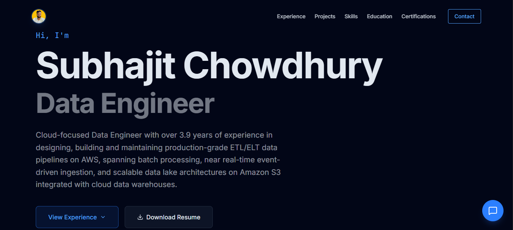

# Data Engineering Portfolio | Subhajit Chowdhury

> An AI-powered interactive portfolio that allows users to explore my experience through conversation instead of static navigation.

🌐 **Live Demo**: https://subhajit-chowdhury-portfolio.vercel.app/

---

## 🖼️ Portfolio Preview

<p align="center">
  
</p>

---

## 🎥 Demo Preview

<p align="center">
  
</p>

---

## Overview

This repository contains my personal portfolio built to present my work as a Data Engineer in a clear and accessible way.

Instead of a traditional static portfolio, this project introduces an interactive AI assistant that allows users to explore my experience, projects, and skills through natural conversation.

This project is developed as part of the **Google Developer Groups (GDG) Solution Challenge**
🔗 https://www.gdgcrcc.tech/solution-challenge

The focus of this submission is to explore how AI can improve the way professional information is accessed and understood.

---

## Context

Most portfolios require manual navigation and scanning through multiple sections, which can make it difficult to quickly find relevant information.

With this project, I aimed to:

* Reduce friction in exploring my profile
* Enable faster access to relevant details
* Create a more interactive and user-friendly experience

---

## Approach

The idea was to combine a modern frontend with an AI-powered assistant that can:

* Understand user queries
* Retrieve relevant portfolio information
* Respond in a clear and concise way

The focus was to keep the system simple, practical, and efficient without overengineering.

---

## Implementation

### Frontend

* React 19 + Vite
* TypeScript
* Tailwind CSS
* Framer Motion
* Lucide React

### AI Integration

* Google Gemini 1.5 Flash (`@google/generative-ai`)
* Context-based prompt design using structured portfolio data
* Controlled responses to keep outputs relevant and factual

### Performance & UX

* Skeleton loaders for smoother initial experience
* Lightweight canvas-based background
* High-contrast dark theme for readability
* Fully responsive across devices

---

## Architecture Overview

The application follows a lightweight client-side architecture with direct AI API integration.

### High-Level Flow

```bash id="kk6e6s"
User (Browser)
     ↓
React Frontend
     ↓
Prompt Construction
     ↓
Google Gemini API
     ↓
Response Handling
     ↓
UI Rendering
```

---

### Architecture Diagram

```bash id="h4b6tt"
+-------------------+
|     User (UI)     |
+-------------------+
          |
          v
+---------------------------+
| React Application (Vite)  |
| - Components              |
| - State Management        |
| - Chat Interface          |
+---------------------------+
          |
          v
+---------------------------+
| Prompt Builder            |
| - Inject Portfolio Data   |
| - Structure Query         |
+---------------------------+
          |
          v
+---------------------------+
| Google Gemini API         |
| (gemini-1.5-flash)        |
+---------------------------+
          |
          v
+---------------------------+
| Response Handler          |
| - Parse Output            |
| - Format Response         |
+---------------------------+
          |
          v
+---------------------------+
| UI Rendering              |
| - Chat Messages           |
| - Loading States          |
+---------------------------+
```

---

### Design Considerations

* No backend required (keeps architecture simple)
* Fast response time with direct API calls
* Clear separation between UI, logic, and AI interaction
* Focus on usability and performance

---

## Key Features

* 🤖 AI-powered assistant for interactive exploration
* 📊 Context-aware responses using portfolio data
* ⚡ Smooth and optimized user experience
* 📱 Fully responsive design
* 🎯 Clean and minimal interface

---

## How the AI Assistant Works (Data Flow)

The assistant is designed to answer questions based only on my portfolio data.

### Step-by-Step Flow

1. **User Input**
   A question is asked through the chat interface

2. **Context Injection**
   Portfolio data (skills, experience, projects) is attached

3. **Prompt Construction**
   User query + structured context are combined

4. **LLM Processing**
   Request is sent to Gemini API

5. **Response Handling**
   Output is received and processed

6. **UI Rendering**
   Response is displayed in the chat

---

### Data Flow Diagram

```bash id="sn9yqx"
User Query
   ↓
React Chat UI
   ↓
Context Injection
   ↓
Prompt Builder
   ↓
Gemini API
   ↓
Response Processing
   ↓
Chat UI Rendering
```

---

### Constraints

* Responses are limited to provided portfolio context
* No external retrieval systems (no RAG pipeline)
* Focused on concise and relevant answers

---

### Why This Approach

* Keeps the system simple and maintainable
* Avoids unnecessary infrastructure
* Demonstrates practical use of LLMs in a real application

---

## Impact

* ⚡ Fast and responsive UI with optimized rendering
* 🤖 AI responses generated in ~1–2 seconds (average)
* 📱 Fully responsive across devices
* 🎯 Improved accessibility of portfolio information through conversational interface

---

## Getting Started

### 1. Clone the Repository

```bash id="n7afiy"
git clone https://github.com/Subhajit-Chowdhury/subhajit-chowdhury-portfolio.git
cd subhajit-chowdhury-portfolio
```

### 2. Install Dependencies

```bash id="ub9r6h"
npm install
```

### 3. Setup Environment Variables

Create a `.env` file:

```env id="bf3nyw"
VITE_GEMINI_API_KEY=your_api_key_here
```

Get your API key from: https://aistudio.google.com/

---

### 4. Run Locally

```bash id="fw3o9x"
npm run dev
```

App runs at:

```id="0i1bcm"
http://localhost:3000
```

---

## Deployment

This project is deployed using Vercel.

To deploy:

1. Push code to GitHub
2. Import into Vercel
3. Add environment variable:

   * `VITE_GEMINI_API_KEY`
4. Deploy

---

## Outcome

This project demonstrates:

* Practical integration of LLMs into user-facing applications
* A more interactive approach to professional portfolios
* Focus on clean design, performance, and usability

It reflects how I approach building solutions by combining **data, systems, and user experience** in a meaningful way.

---

## Contact

* LinkedIn: https://www.linkedin.com/in/subhajit00100/
* GitHub: https://github.com/Subhajit-Chowdhury
* Email: [er.subhajitchowdhury@gmail.com](mailto:er.subhajitchowdhury@gmail.com)

---

*Built with a focus on clarity, usability, and practical application of AI.*
